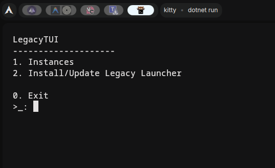
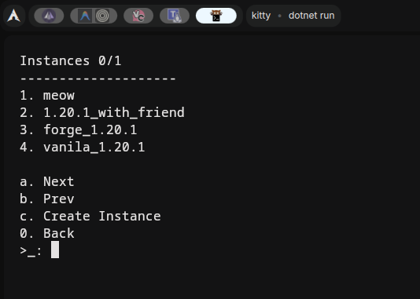
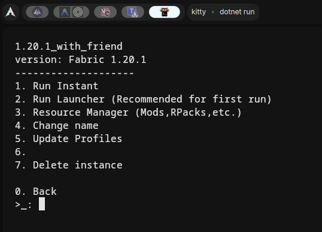
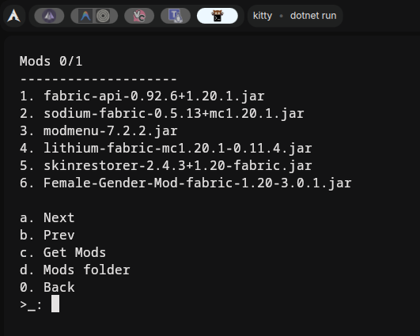
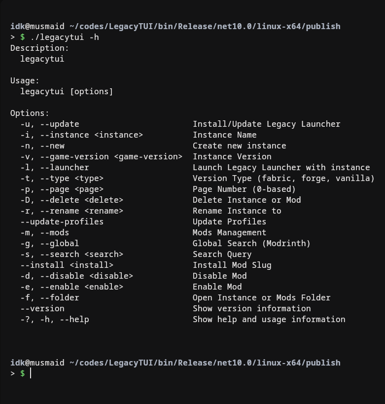

<div align="center">

<h1>

LegacyTUI

</h1>

[](https://t.me/musdev)
[](https://github.com/musdev13)

**Use [Legacy Launcher (TL Legacy)](https://llaun.ch/) in terminal**

</div>

<h2>Contents</h2>

- [About](#about)
  - [Screenshots](#screenshots)
    - [TUI](#tui)
    - [CLI](#cli)
- [Installation](#installation)
  - [Binary](#binary)
    - [Dependencies](#dependencies)
    - [Installing](#installing)
  - [Build from source](#build-from-source)
    - [Dependencies](#dependencies-1)
    - [Building](#building)
- [Usage](#usage)
  - [Auth](#auth)
  - [Flags](#flags)
    - [Table](#table)
    - [Examples](#examples)
      - [Install/Update Legacy Launcher](#installupdate-legacy-launcher)
      - [List Versions](#list-versions)
      - [Page of list](#page-of-list)
      - [Create Instance](#create-instance)
      - [Open Instance Folder](#open-instance-folder)
      - [Recommended mods on Modrinth](#recommended-mods-on-modrinth)
      - [Searching mods on Modrinth](#searching-mods-on-modrinth)
      - [Installing mods from Modrinth](#installing-mods-from-modrinth)
      - [List installed mods](#list-installed-mods)
      - [Disable mod](#disable-mod)
      - [Enable mod](#enable-mod)
      - [Delete mod](#delete-mod)
      - [Launch Legacy Launcher with instance](#launch-legacy-launcher-with-instance)
      - [Launch instance instantly](#launch-instance-instantly)
  - [TUI](#tui-1)

## About
**LegacyTUI** is a *tui* and *cli* based launcher for [Legacy Launcher (TL Legacy)](https://llaun.ch/) written in **C#***(.NET Core 10)*.

It was created to make creating minecraft instances easier and faster. And you can download mods from [Modrinth](https://modrinth.com/) directly from the launcher.

### Screenshots
#### TUI

<div style="display: flex; flex-wrap: wrap; justify-content: center; gap: 10px; margin-bottom: 20px;">
  
  
</div>

<div style="display: flex; flex-wrap: wrap; justify-content: center; gap: 10px;">
  
  
</div>

#### CLI


## Installation
### Binary
#### Dependencies
- Any *Java Runtime Environment* **(JRE)**
#### Installing
Download the latest binary from [GitHub Releases](https://github.com/musdev13/LegacyTUI/releases).

[Windows](https://github.com/musdev13/LegacyTUI/releases/download/v1.0.0/legacytui.exe) |
[Linux](https://github.com/musdev13/LegacyTUI/releases/download/v1.0.0/legacytui)

> ⚠️ **Warning:** You need to make directory for legacytui and move the binary there. legacytui will create files and directories in the same directory.

### Build from source
#### Dependencies
- .NET Core 10
- Any *Java Runtime Environment* **(JRE)**
#### Building
1. Clone the repository and cd into
```bash
git clone --depth 1 https://github.com/musdev13/LegacyTUI.git
cd LegacyTUI
```

2. Build the project
- Linux
```bash
./publish.sh
```
- Windows
```bash
./publish-win.sh
```

3. Get the `legacytui` binary in
- Linux: `bin/Release/net10.0/linux-x64/publish/legacytui`
- Windows: `bin/Release/net10.0/win-x64/publish/legacytui.exe`

## Usage
### Auth
> Launch `bootstrap.jar` with java, login to your account, copy `launcher_profiles.json` and `tlauncher_profiles.json` from `.minecraft` folder to the same directory as `legacytui`.
> It will be your default account.  
### Flags
#### Table
| Flag                                | Description                           |
| ----------------------------------- | ------------------------------------- |
| -?, -h, --help                      | Show help and usage information       |
| -u, --update                        | Install/Update Legacy Launcher        |
| -i, --install                       | Install Legacy Launcher               |
| -i, --instance \<instance\>         | Instance Name                         |
| -n, --new                           | Create new instance                   |
| -v, --game-version \<game-version\> |
| -l, --launcher                      | Launch Legacy Launcher with instance  |
| -t, --type \<type\>                 | Version Type (fabric, forge, vanilla) |
| -p, --page \<page\>                 | Page Number (0-based)                 |
| -D, --delete \<modfile\>            | Delete Instance or Mod                |
| -r, --rename \<rename\>             | Rename Instance to                    |
| --update-profiles                   | Update Profiles                       |
| -m, --mods                          | Mods Management                       |
| -g, --global                        | Global Search (Modrinth)              |
| -s, --search \<search\>             | Search Query                          |
| --install \<modslug\>               | Install Mod Slug                      |
| -d, --disable \<modfile\>           | Disable Mod                           |
| -e, --enable \<modfile\>            | Enable Mod                            |
| -f, --folder                        | Open Instance or Mods Folder          |
| --version                           | Show version information              |

#### Examples
##### Install/Update Legacy Launcher
```bash
./legacytui -u
```
```
File downloaded: /home/idk/codes/LegacyTUI/bin/Release/net10.0/linux-x64/publish/bootstrap.jar : https://dl.llaun.ch/legacy/bootstrap
```
##### List Versions
```bash
./legacytui -v "" -t "fabric"
```
```
Versions (fabric) Page 0/4:
Fabric 1.21.10 - modified
Fabric 1.21.9 - modified
Fabric 1.21.8 - modified
Fabric 1.21.7 - modified
Fabric 1.21.6 - modified
Fabric 1.21.5 - modified
Fabric 1.21.4 - modified
Fabric 1.21.3 - modified
Fabric 1.21.2 - modified
Fabric 1.21.1 - modified
```
##### Page of list
```bash
./legacytui -v "" -t "fabric" -p 1
```
```
Versions (fabric) Page 1/4:
Fabric 1.21 - modified
Fabric 1.20.6 - modified
Fabric 1.20.5 - modified
Fabric 1.20.4 - modified
Fabric 1.20.3 - modified
Fabric 1.20.2 - modified
Fabric 1.20.1 - modified
Fabric 1.20 - modified
Fabric 1.19.4 - modified
Fabric 1.19.3 - modified
```
##### Create Instance
```bash
./legacytui -n -i "new_instance" -v "Fabric 1.20.1"
```
```
Instance new_instance created.
```
##### Open Instance Folder
```bash
./legacytui -f -i "new_instance"
```
```
Opening instance folder: /home/idk/codes/LegacyTUI/bin/Release/net10.0/linux-x64/publish/instances/new_instance
```

##### Recommended mods on Modrinth
```bash
./legacytui -i "new_instance" -m -g
```
```
Searching Modrinth for ''...
fabric-api - Fabric API - modmuss50
sodium - Sodium - jellysquid3
cloth-config - Cloth Config API - shedaniel
iris - Iris Shaders - coderbot
ferrite-core - FerriteCore - malte0811
entityculling - Entity Culling - tr7zw
modmenu - Mod Menu - Prospector
lithium - Lithium - jellysquid3
immediatelyfast - ImmediatelyFast - RaphiMC
yacl - YetAnotherConfigLib (YACL) - isxander
architectury-api - Architectury API - shedaniel
xaeros-minimap - Xaero's Minimap - thexaero
fabric-language-kotlin - Fabric Language Kotlin - modmuss50
...
```

##### Searching mods on Modrinth
```bash
./legacytui -i "new_instance" -m -s "sodium"
```
```
Searching Modrinth for 'sodium'...
sodium - Sodium - jellysquid3
sodium-extra - Sodium Extra - FlashyReese
sodium-dynamic-lights - Sodium Dynamic Lights - Txni
sodium-shadowy-path-blocks - Sodium Shadowy Path Blocks - Rynnavinx
sodium-options-api - Sodium Options API - Txni
sodium-extras - Sodium Extras - Txni
...
```

##### Installing mods from Modrinth
```bash
./legacytui -i "new_instance" -m --install sodium
```
```
File downloaded: /home/idk/codes/LegacyTUI/bin/Release/net10.0/linux-x64/publish/instances/new_instance/mods/sodium-fabric-0.5.13+mc1.20.1.jar : https://cdn.modrinth.com/data/AANobbMI/versions/OihdIimA/sodium-fabric-0.5.13%2Bmc1.20.1.jar
Installing dependencies...
Installed sodium
```

##### List installed mods
```bash
./legacytui -i "new_instance" -m
```
```
Mods in new_instance:
fabric-api-0.92.6+1.20.1.jar
sodium-fabric-0.5.13+mc1.20.1.jar
```

##### Disable mod
```bash
./legacytui -i "new_instance" -m -d "sodium-fabric-0.5.13+mc1.20.1.jar"
```
```
Disabled sodium-fabric-0.5.13+mc1.20.1.jar
```

##### Enable mod
```bash
./legacytui -i "new_instance" -m -e "sodium-fabric-0.5.13+mc1.20.1.jar"
```
```
Enabled sodium-fabric-0.5.13+mc1.20.1.jar
```

##### Delete mod
```bash
./legacytui -i "new_instance" -m -D "sodium-fabric-0.5.13+mc1.20.1.jar"
```
```
Deleted mod sodium-fabric-0.5.13+mc1.20.1.jar
```

##### Launch Legacy Launcher with instance
```bash
./legacytui -i "new_instance" -l
```
```
Launching new_instance...
java -jar "/home/idk/codes/LegacyTUI/bin/Release/net10.0/linux-x64/publish/bootstrap.jar"  --directory "/home/idk/codes/LegacyTUI/bin/Release/net10.0/linux-x64/publish/instances/new_instance" --version "Fabric 1.20.1"
Error: SLF4J(W): Class path contains multiple SLF4J providers.
Error: SLF4J(W): Found provider [net.legacylauncher.bootstrap.BootstrapLoggingServiceProvider@2328c243]
Error: SLF4J(W): Found provider [org.slf4j.simple.SimpleServiceProvider@bebdb06]
Error: SLF4J(W): See https://www.slf4j.org/codes.html#multiple_bindings for an explanation.
Error: SLF4J(I): Actual provider is of type [net.legacylauncher.bootstrap.BootstrapLoggingServiceProvider@2328c243]
Error: [main] INFO net.legacylauncher.bootstrap.BoostrapRestarter - Using system classpath
...
```

##### Launch instance instantly
```bash
./legacytui -i "new_instance"
```
```
./legacytui -i "new_instance"                                                                                                                                                [±main ●]
Launching new_instance...
java -jar "/home/idk/codes/LegacyTUI/bin/Release/net10.0/linux-x64/publish/bootstrap.jar" --launch --directory "/home/idk/codes/LegacyTUI/bin/Release/net10.0/linux-x64/publish/instances/new_instance" --version "Fabric 1.20.1"
Error: SLF4J(W): Class path contains multiple SLF4J providers.
Error: SLF4J(W): Found provider [net.legacylauncher.bootstrap.BootstrapLoggingServiceProvider@2328c243]
Error: SLF4J(W): Found provider [org.slf4j.simple.SimpleServiceProvider@bebdb06]
Error: SLF4J(W): See https://www.slf4j.org/codes.html#multiple_bindings for an explanation.
Error: SLF4J(I): Actual provider is of type [net.legacylauncher.bootstrap.BootstrapLoggingServiceProvider@2328c243]
Error: [main] INFO net.legacylauncher.bootstrap.BoostrapRestarter - Using system classpath
...
```

### TUI
You can run `legacytui` without any flags to open the TUI.
```bash
./legacytui
```